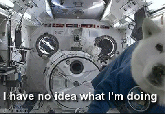
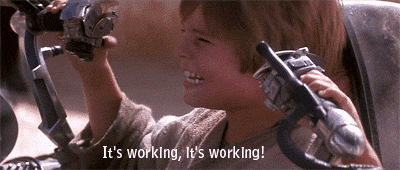
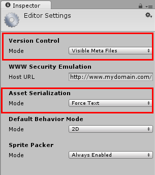
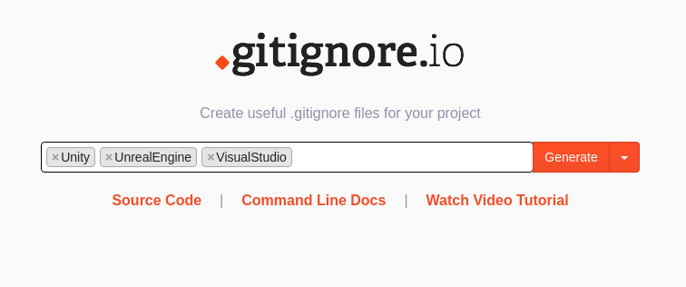

# Git Workshop 
###<small> (auch für Designer)</small>

Note:
+ Projekt ansehen
+ Aktueller Build
+ Assets anschauen im Level
+ Level bauen
+ Tweaking, Testing etc.

## Git Hoster

+ [Bitbucket](bitbucket.org) [¹](https://www.atlassian.com/software/views/bitbucket-academic-license.jsp)
+ [GitHub](github.com) [¹](https://education.github.com/)
+ [Projektlaufwerk FH Trier RZ](https://www.hochschule-trier.de/index.php?id=16238)
+ [GitLab FSI](https://gitlab.fsi.hochschule-trier.de/users/sign_in)

----

<small>¹ academic license</small>

Note:
+ Alle kostenlos (studentisch)
+ 2x FH
+ Zeigen werde ich Bitbucket und GitHub

## Workflow

clone <!-- .element: class="fragment"-->
$\rightarrow{}$ <!-- .element: class="fragment" -->
**Änderungen** <!-- .element: class="fragment" -->
$\leftrightarrow{}$ <!-- .element: class="fragment" -->
add <!-- .element: class="fragment" -->
$\leftrightarrow{}$ <!-- .element: class="fragment" -->
commit <!-- .element: class="fragment" -->
$\leftrightarrow{}$ <!-- .element: class="fragment" -->
push <!-- .element: class="fragment" -->

Note:
+ Clone => Herunterladen
+ Add => Hinzufügen
+ Commit => Dazu stehen
+ Push => Hochladen

pull <!-- .element: class="fragment"-->
$\leftrightarrow{}$ <!-- .element: class="fragment" -->
**Änderungen** <!-- .element: class="fragment" -->
$\leftrightarrow{}$ <!-- .element: class="fragment" -->
add <!-- .element: class="fragment" -->
$\leftrightarrow{}$ <!-- .element: class="fragment" -->
commit <!-- .element: class="fragment" -->
$\leftrightarrow{}$ <!-- .element: class="fragment" -->
push <!-- .element: class="fragment" -->

Note:
+ Pull => Updaten

## Branches

+ "Versionen"
+ Mehrere Historien
+ Arbeitsbereiche

Note:
Asset-Branches, Mergen

<!-- .element: class="fragment" -->

Note:
Tests, Refactoring, halbfertige Sachen

## Merge Conflicts

Note:
Sind nicht schlimm!
Müssen passieren

## Tags

Note:
Versionsnummern / Markierungen

## Nebeneffekte

Note:
Fast umsonst kriegt man folgendes:
Arbeitsdokumentation, Änderungshistorie, Hotfixes einspielbar,
Präsentationsspeicher

### Lockerer Code

### Backups

Note:

+ "Computer kaputt Änderung weg"
+ Branches (die Länger als 1 Tag dauern) sollten 1x am Tag hochgeladen werden

### Raum für Experimente

Note:
Grafiktests, Stiltests, Lichteinstellungen, etc.

## Tools

+ TortoiseGit<!-- .element: class="fragment" -->
+ SourceTree<!-- .element: class="fragment" -->
+ GitExtensions<!-- .element: class="fragment" -->
+ GitHub<!-- .element: class="fragment" -->
+ SmartGit<!-- .element: class="fragment" -->
+ u.v.m.<!-- .element: class="fragment" -->

## Git-LFS

[https://git-lfs.github.com/](https://git-lfs.github.com/)

Note:
Für große Dateien (Texturen, Audio, etc.) gibt es Git-LFS

## Workshop (Tortoise Git)

Note:

1. Clonen (Bitbucket und GitHub - FSI GitLab funktioniert analog)
+ Https (SSH später)
+ Änderung machen
+ Commiten
+ Pushen

## Unity Specifics

Edit/Project Settings/Editor
	

	<small>Version Control: Visible Meta Files</small>

	
<small>Asset Serializaton: Force Text</small>

Note:

+ Nicht perfekt, aber gute Basis
+ Download als Datei
+ schnell erweiterbar
+ Tag basiert

## Danke

[GitHub.io Präsentation](http://hatieth.github.io/git-workshop)

[GitHub Repo der Präsentation](https://github.com/hatieth/git-workshop)
